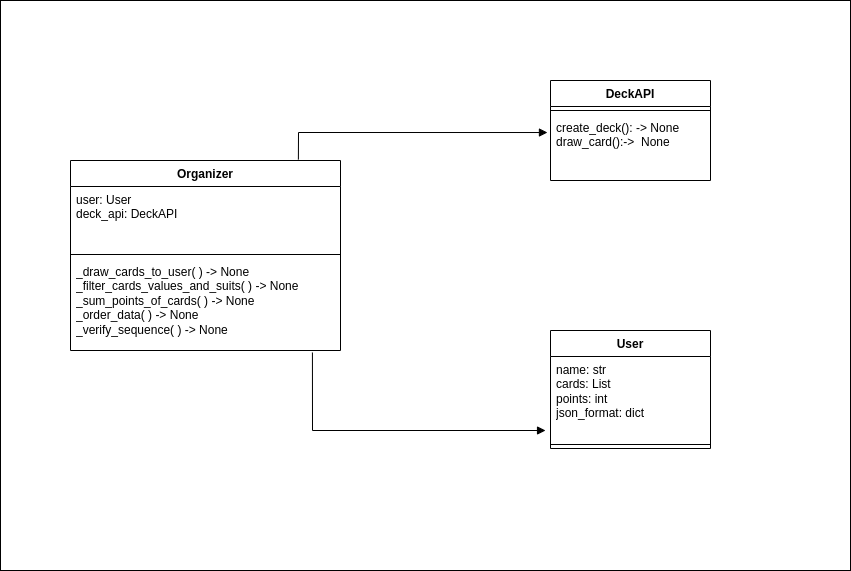

# desafio

Program that interacts with the cards API deck https://deckofcardsapi.com/. The program must create a deck using an API, represented by a deck_id on the platform.
In this situation, two players named “Alan” and “Bruno” are going to play a card game and need 11 cards each, which must be drawn from a random deck using an API.
Each of the 11-card hands must have its cards organized by suit and ordered by value, with the numeric cards having their own values ​​and As = 1; the Valete = 11; the Rainha = 12; the Rei = 13.
A straight in this game will be any set of three or more cards of the same suit with consecutive values. Your program must check whether there is a sequence in each player's hand. 
If the player has a straight while the other has none, he will be declared the WINNER, and, if both have straights, or both have none, a DRAW will be declared.
The program must display JSON on standard output containing:
• Field “cards” with the players’ hands organized and ordered with the suits in Portuguese (”paus”,
”ouros”, ”copas”, ”espadas”);
• Boolean indicator “has_sequencia”, indicating whether there is a sequence in each player's hand;
• A “winner” field, containing the name of the winner (“alan” or “bruno”) or “tie” if there is
a draw has occurred.

